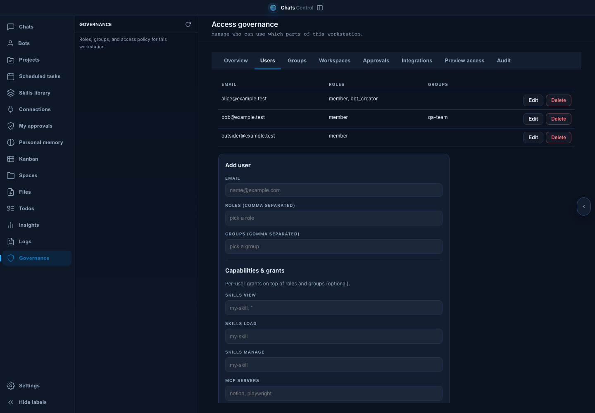
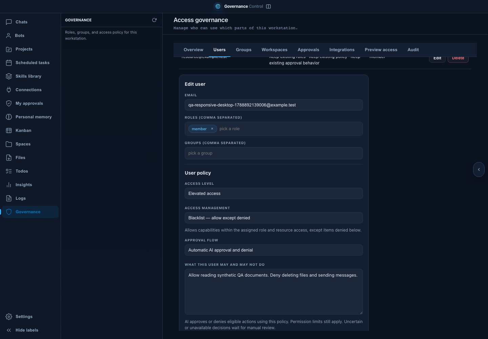
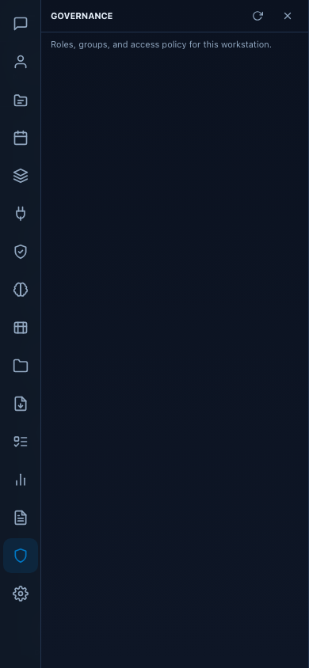
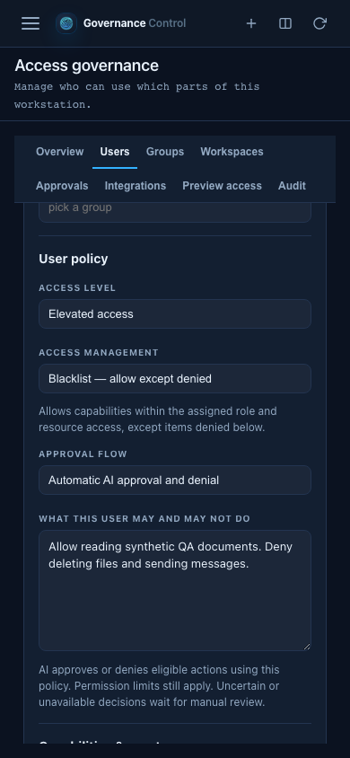

# Per-user governance UI evidence

Synthetic identities, actual Chromium frontend. Baseline 571c11f9; candidate source validated in run 20260908-202702-435893000. Responsive scenarios edit, save, reload and reopen the actual controls at 1440, 1024 and 390 pixels.

| Before | After |
|---|---|
|  |  |
|  |  |

[Laptop after](screenshots/governance-after-laptop.png). See the separate browser QA scripts and evidence for exact acceptance assertions.
