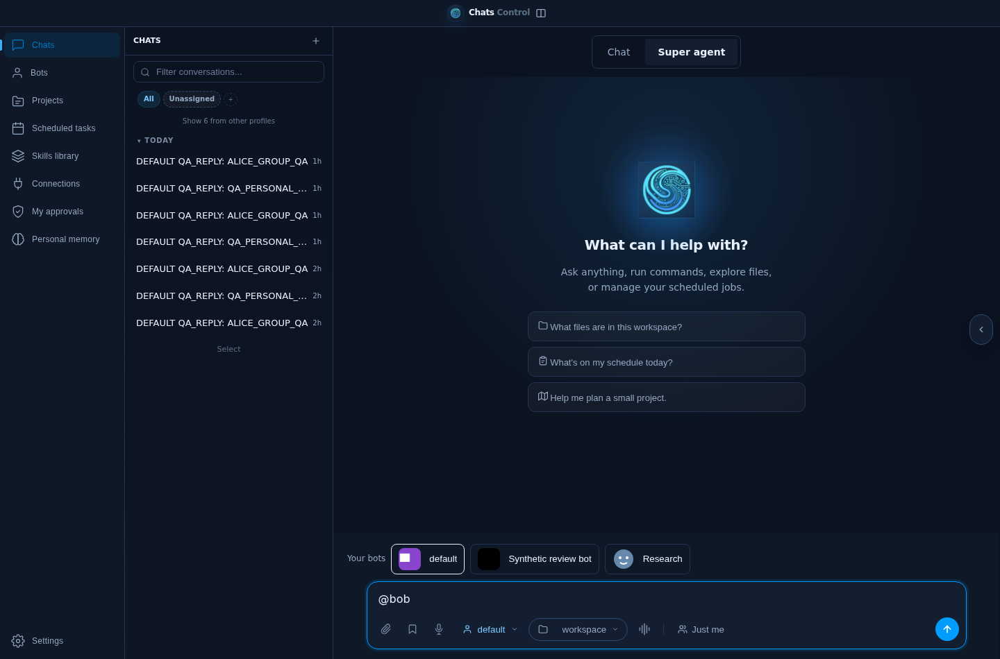
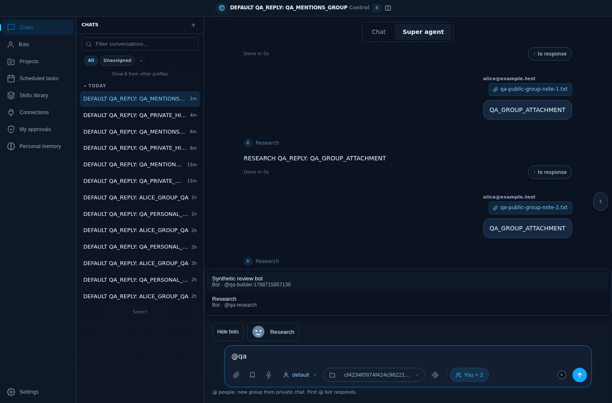
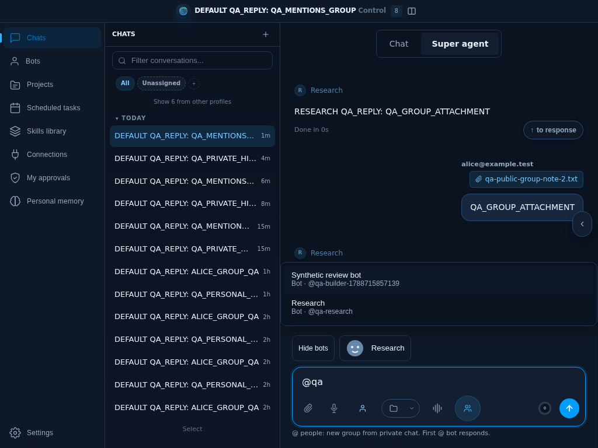
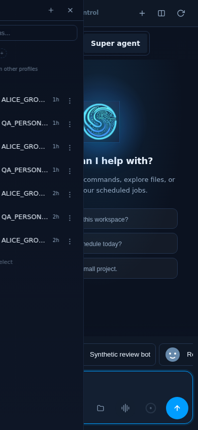
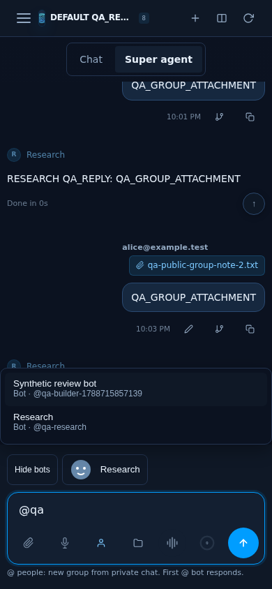

# Chat mentions and collapsible bots: release QA

## Outcome

The bot roster can be hidden and expanded, with its preference scoped to the signed-in account in the browser. A unified @ picker distinguishes bots from people and supports keyboard and touch. Sending a human mention from a private conversation starts a fresh group without copying its earlier history, files, personal context or workspace. The first mentioned bot responds. Other mentioned bots are added to the roster; they are not automatically run in parallel.

Existing groups retain their audience controls. Project roster changes remain in project controls. Busy or failed recipient preparation preserves the draft. Bot discovery paints independently of the people directory, and failed catalogs can be retried without exposing another context's cached results.

## Verification

- 308 focused backend, authorization, personal-context, chat and upload tests passed through the canonical test runner.
- Recipient behavior tests cover multiple people, identical friendly names, canonical bot identifiers, prefix collisions and punctuation. JavaScript syntax, Python lint on new modules/tests, and diff checks passed.
- Actual Chromium boot checks cover early bot display, a slow people directory, failed-directory retry, boot readiness and stale-context exclusion.
- Isolated full application browser QA: collapse persists after reload; keyboard people/bot selection; a fresh group excludes seeded private history; the selected Research bot replies; a second signed-in account reads and lists the group; bot identity persists and renders after reload; mobile dropdown/Escape; attachment and busy guards retain the draft; unknown recipients are denied. No JavaScript errors were observed. Desktop, laptop and 390px mobile evidence is attached.
- Bot attribution regression was demonstrated before the fix, both during DB/sidecar reconciliation and with the exact multi-space mention draft captured by browser QA. The fix retains server-selected identity and leaves older or unmatched turns untouched.

Explicit group attachment QA also passed: upload returned 200, the rendered download link returned the exact synthetic file, an outsider was denied, and a different session could not read that attachment. The raw attachment route uses request-scoped visibility; other file-manager resolver callers retain their previous behavior.

## Baseline failures and limits

A broader reconciliation suite had 47 passes and six failures. The same six failures were reproduced on the unchanged a4b99e2c baseline in an isolated checkout: one null timestamp discrepancy and five state-DB-prefix tests (including missing get_state_db_session_message_prefix_summary). They are not introduced by this release. The earlier repository-wide collection failures remain outside this focused change; no claim of a wholly green upstream test suite is made.

Browser inference uses a deterministic local provider fixture. This proves application dispatch and UI behavior, not external model latency. Recipient retry deduplication is bounded and in-process; it is not restart-durable. Existing private conversations and account permissions are preserved. The legacy participant-management modal keeps its existing behavior; this new private-to-fresh-group rule belongs to @ preparation.

## Screenshots

The release browser smoke also covers identity-less startup: people discovery waits for an authenticated identity, and late identity resolution refreshes the picker automatically without navigation. All three smoke pages and the actual delayed-identity boot regression pass.
